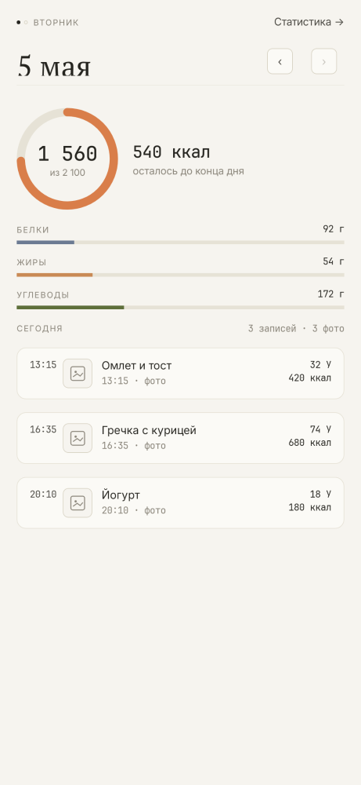
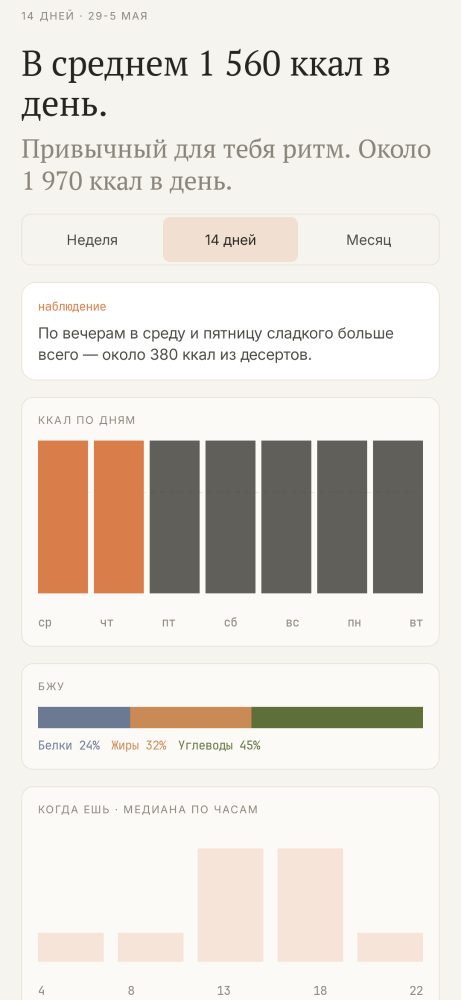
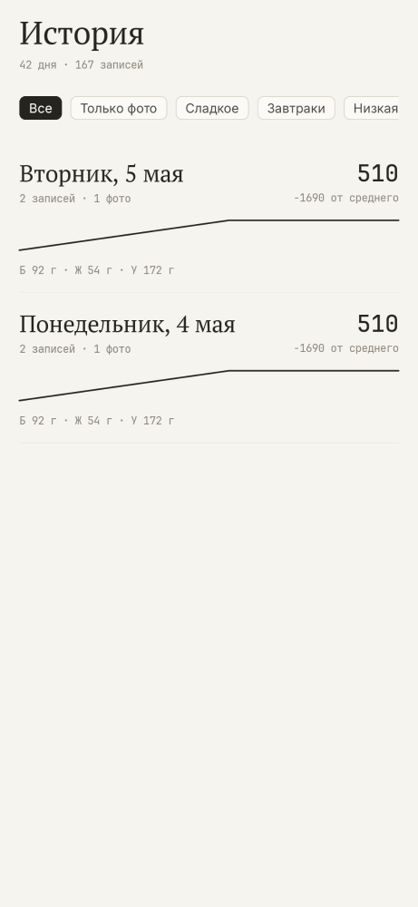
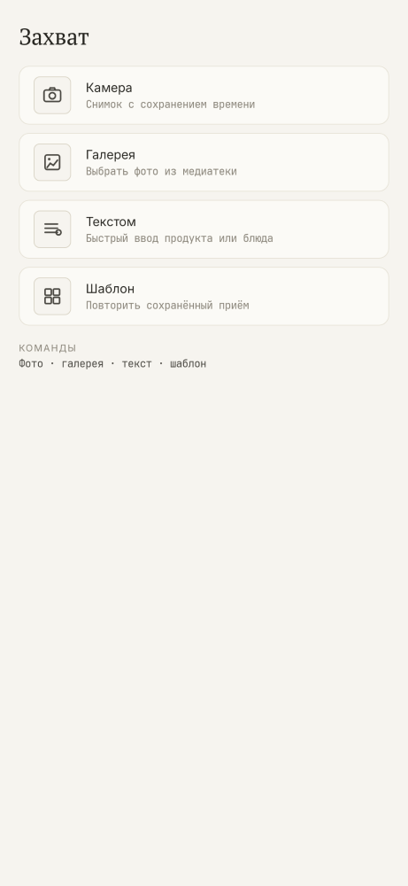
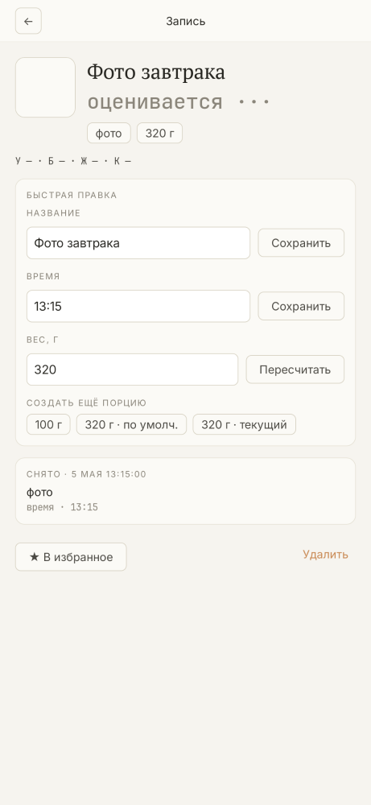
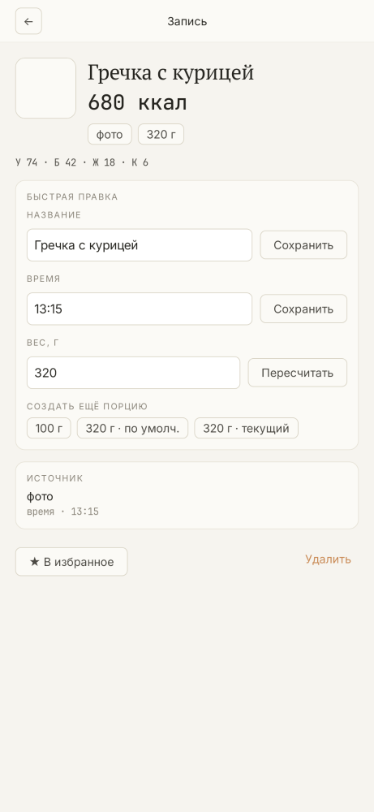
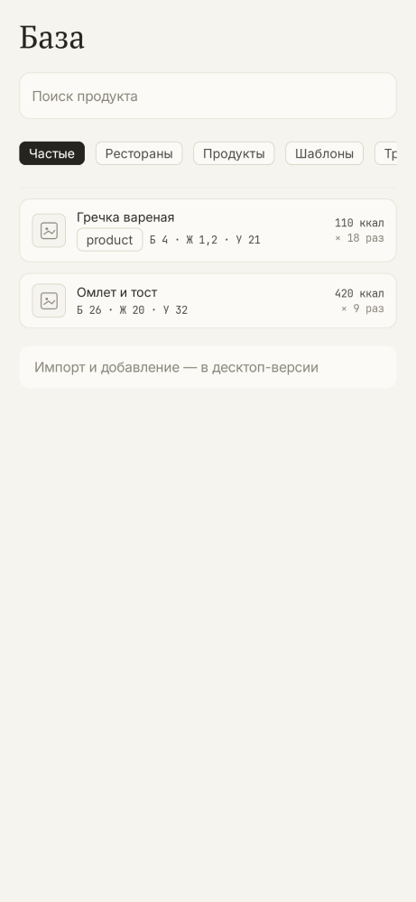
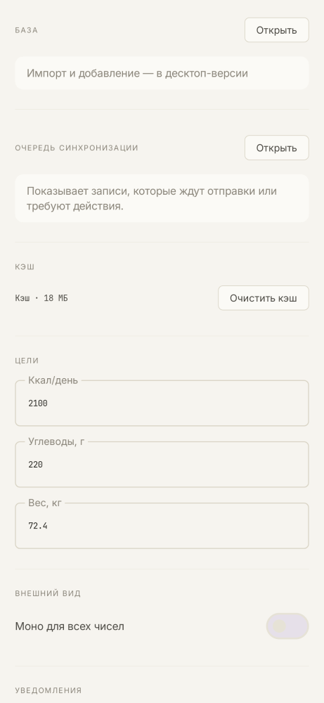
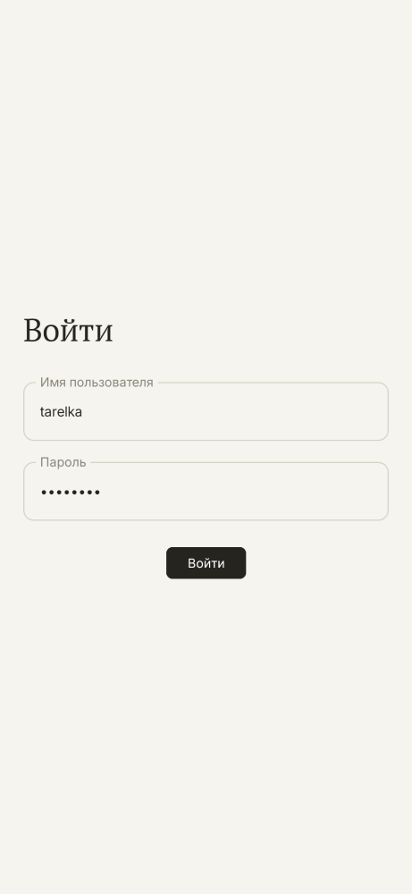

# Tarelka Brand

Tarelka — спокойный дневник еды: фиксирует блюда, показывает ритм дня и говорит наблюдениями без оценок, тревоги и медицинских обещаний.

## Voice Principles

Tarelka is a capture-and-glance food diary. It records meals, totals, history, and patterns without turning food into a score. The product speaks in short Russian phrases, uses server-confirmed facts, and avoids praise, blame, alarm, medical advice, insulin language, streak pressure, or goal-shaming. Observations are descriptive: what happened, when it tends to happen, and how it compares with the user's own recent rhythm.

The backend owns accepted nutrition totals, daily averages, insight wording, and history counts. The Android client displays those values and may show local pending rows only as pending context. Pending data is never mixed into headline totals.

## Color

| Token | Hex | Use | Do not use for |
| --- | --- | --- | --- |
| `bg` | `#F6F4EF` | App background, Android 12+ splash background | Cards or active chips |
| `surface` | `#FBFAF6` | Main cards and sheets | Page-wide background |
| `surface2` | `#FFFFFF` | Raised content surfaces without shadow | Shadow replacement |
| `ink` | `#25241F` | Primary text, active filter fill | Macro semantic color |
| `ink2` | `#4A4842` | Secondary body copy | Disabled text |
| `muted` | `#8A857A` | Kicker/meta text, chart labels | Important values |
| `hairline` | `#E6E2D6` | 0.5dp borders, dividers, empty tracks | Large fills |
| `hairline2` | `#D8D3C4` | Stronger secondary borders | Primary text |
| `olive` | `#5E6F3A` | Carbohydrate bars, shared accent token | Tarelka brand accent |
| `slate` | `#6B7A92` | Protein bars | Brand mark or tabs |
| `terracotta` | `#C98A55` | Fat bars | Tarelka brand accent |
| `tangerine` | `#D97E4A` | Food flavor only: logo dot, active tab dot, kcal ring, insight kicker, sweet markers | Shared `src/main`, gluco flavor, macro bars |
| `graphite` | `#2D3340` | Chart bars and sparkline strokes | Warning/error copy |
| `green` | `#6B8A5A` | Existing positive system color | Food judgement |

Tangerine is flavor-scoped. A literal `0xFFD97E4A` or `#D97E4A` outside `src/food/` should fail review unless it is documentation or a test that enforces the rule.

## Logo Usage

The shipped logo direction is the serif lowercase-style `T`/`t` monogram with a tangerine dot. Use the monochrome mark on tangerine for launcher assets and the monochrome mark on off-white inside the app.

Clear space around the mark should be at least the dot diameter on all sides. Minimum rendered size is 16dp in the brand lockup and 24dp in standalone UI. Do not rotate, outline, shadow, gradient-fill, recolor the dot, or combine the mark with glucose-related symbols. The app lockup is always: 16dp mark, 8dp gap, serif "Tarelka", 24dp total height, hairline divider below.

## Copy

| Do | Do not |
| --- | --- |
| "К утру немного больше обычного" | "Превышение утром" |
| "+184 от среднего" | "Перебор на 184 ккал" |
| "Похоже на твой обычный завтрак" | "Молодец, цель соблюдена" |
| "цель не задана" | "цель не достигнута" |
| "Чаще всего ешь в 13:00 и 18:00" | "Старайся есть в 13:00 и 18:00" |
| "Меньше 3 дней истории" | "Недостаточно данных для оценки" |

Copy must stay informational. Avoid `превышение`, `плохо`, `молодец`, `перебор`, `недобор`, `цель не достигнута`, insulin advice, bolus advice, treatment advice, and streak pressure.

## Screenshots

